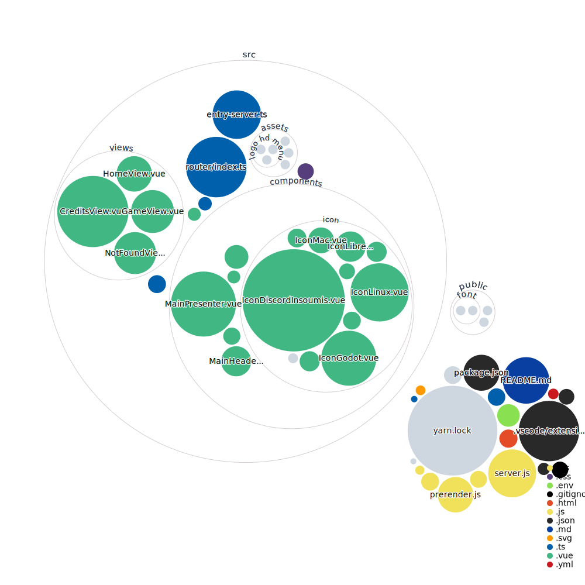

# laec-est-toi-website

Site web pour le jeu [LAEC EST TOI](https://github.com/Insoumis/laec-est-toi)


[](https://mango-dune-07a8b7110.1.azurestaticapps.net/?repo=Insoumis%2Flaec-est-toi-website)
 


## Technos utilisés

### JS
- [TypeScript](https://www.typescriptlang.org/)
- [VueJS](https://vuejs.org/)
#### Librairies VueJS
- [Vue Router](https://router.vuejs.org/)
- [VueUse](https://vueuse.org/)
### CSS
- [Tailwind CSS](https://tailwindcss.com/)
### Qualité du code
- [ESLint](https://eslint.org/)
- [Prettier](https://prettier.io/)
### Autres
- [Yarn](https://classic.yarnpkg.com/)
- [Docker](https://www.docker.com/)
- [Matomo](https://matomo.org/)

On fait pas de tests parce qu'on est des dingues.

## Lancer le site en local

Clonez le repo, puis installez les dépendances en local avec `yarn`
```sh
git clone https://github.com/Insoumis/laec-est-toi-website.git
cd laec-est-toi-website
yarn
```

Vous pouvez maintenant lancer le site de différentes manières :

### Lancer simplement (SPA) le site en mode dev avec du hot reload
```sh
yarn dev
```
### Lancer avec le SSR le site en mode dev avec du hot reload
```sh
yarn dev:ssr
```
### Build avec Docker et lancer le site en mode prod (SSG)
```sh
yarn docker:build
yarn docker:run
```
### Build avec `docker-compose` et lancer le site en mode prod (SSG)
```sh
docker-compose build
docker-compose up   
```
(Il se peut que le cache ne se clear pas bien entre deux builds, donc n'hésitez pas à remove l'ancienne image complètement avant de rebuild)

### Linter le projet avec ESLint

```sh
npm run lint
```

## À propos du `.env`

Le `.env`contient le lien vers tous les fichiers téléchargeables (ex: `VITE_GAME_URL_WINDOWS`), ainsi que des valeurs utiles pour générer les tags `<meta />` qui permettent de prévisualiser le lien du site quand il est posté sur les réseaux sociaux. Il suffit donc de changer la valeur de ces variables et de rebuild le site pour que les téléchargements se mettent à jour. 🐢

## Recommendations pour l'IDE + plugins

[VSCode](https://code.visualstudio.com/) + [Volar](https://marketplace.visualstudio.com/items?itemName=johnsoncodehk.volar) (and disable Vetur) + [TypeScript Vue Plugin (Volar)](https://marketplace.visualstudio.com/items?itemName=johnsoncodehk.vscode-typescript-vue-plugin).

## Remerciements

À tous les insoumis qui oeuvrent quotidiennement pour changer les règles du jeu
